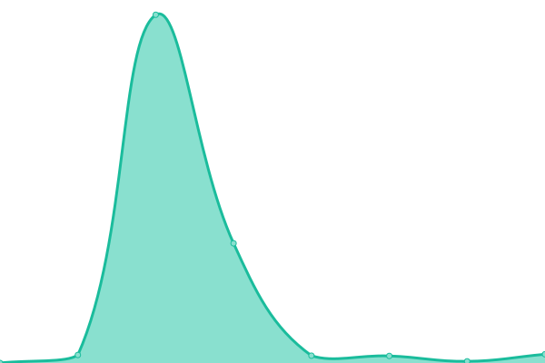

# [📈 Live Status](https://status.deepads.com.br): <!--live status--> **🟧 Partial outage**

This repository contains the open-source uptime monitor and status page for [Deep Ads](https://deepads.com.br/), powered by [Upptime](https://github.com/upptime/upptime).

With [Upptime](https://upptime.js.org), you can get your own unlimited and free uptime monitor and status page, powered entirely by a GitHub repository. We use [Issues](https://github.com/Deep-Ads/status/issues) as incident reports, [Actions](https://github.com/Deep-Ads/status/actions) as uptime monitors, and [Pages](https://status.deepads.com.br) for the status page.

<!--start: status pages-->
<!-- This summary is generated by Upptime (https://github.com/upptime/upptime) -->
<!-- Do not edit this manually, your changes will be overwritten -->
<!-- prettier-ignore -->
| URL | Status | History | Response Time | Uptime |
| --- | ------ | ------- | ------------- | ------ |
|  [Página de vendas](https://www.deeptools.com.br) | 🟩 Up | [pagina-de-vendas.yml](https://github.com/Deep-Ads/status/commits/HEAD/history/pagina-de-vendas.yml) | 

 1661ms
     
 | 

<a href="https://status.deepads.com.br/history/pagina-de-vendas">98.73%</a>
    

|  [Área de membros](https://painel.deeptools.com.br) | 🟩 Up | [area-de-membros.yml](https://github.com/Deep-Ads/status/commits/HEAD/history/area-de-membros.yml) | 

 1495ms
     
 | 

<a href="https://status.deepads.com.br/history/area-de-membros">100.00%</a>
    

|  [Redirecionador de grupos](https://br.deepads.com.br) | 🟩 Up | [redirecionador-de-grupos.yml](https://github.com/Deep-Ads/status/commits/HEAD/history/redirecionador-de-grupos.yml) | 

 875ms
     
 | 

<a href="https://status.deepads.com.br/history/redirecionador-de-grupos">98.99%</a>
    

|  [API-1](https://wpp-01.deepads.com.br/) | 🟥 Down | [api-1.yml](https://github.com/Deep-Ads/status/commits/HEAD/history/api-1.yml) | 

 9707ms
     
 | 

<a href="https://status.deepads.com.br/history/api-1">85.95%</a>
    

|  [API-2](https://wpp-03.deepads.com.br/) | 🟩 Up | [api-2.yml](https://github.com/Deep-Ads/status/commits/HEAD/history/api-2.yml) | 

 4696ms
     
 | 

<a href="https://status.deepads.com.br/history/api-2">97.98%</a>
    

|  [API-3](https://wpp-04.deepads.com.br/) | 🟥 Down | [api-3.yml](https://github.com/Deep-Ads/status/commits/HEAD/history/api-3.yml) | 

 3724ms
     
 | 

<a href="https://status.deepads.com.br/history/api-3">96.65%</a>
    

|  [API-4](https://wpp-05.deepads.com.br/) | 🟩 Up | [api-4.yml](https://github.com/Deep-Ads/status/commits/HEAD/history/api-4.yml) | 

 2542ms
     
 | 

<a href="https://status.deepads.com.br/history/api-4">91.87%</a>
    

<!--end: status pages-->

[**Visit our status website →**](https://status.deepads.com.br)

## 📄 License

- Powered by: [Upptime](https://github.com/upptime/upptime)
- Code: [MIT](./LICENSE) © [Deep Ads](https://deepads.com.br/)
- Data in the `./history` directory: [Open Database License](https://opendatacommons.org/licenses/odbl/1-0/)
