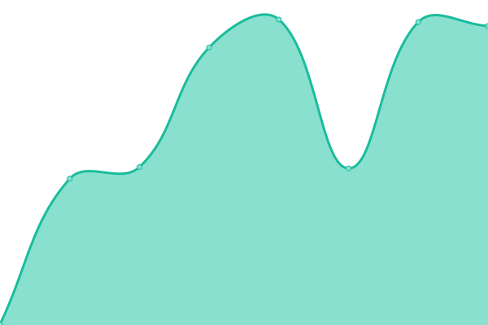
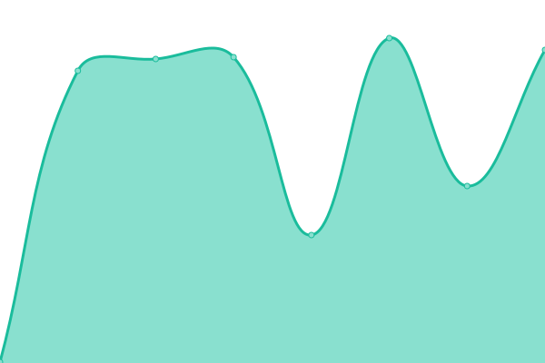

# [📈 Live Status](https://status.deepads.com.br): <!--live status--> **🟩 All systems operational**

This repository contains the open-source uptime monitor and status page for [Deep Ads](https://deepads.com.br/), powered by [Upptime](https://github.com/upptime/upptime).

With [Upptime](https://upptime.js.org), you can get your own unlimited and free uptime monitor and status page, powered entirely by a GitHub repository. We use [Issues](https://github.com/Deep-Ads/status/issues) as incident reports, [Actions](https://github.com/Deep-Ads/status/actions) as uptime monitors, and [Pages](https://status.deepads.com.br) for the status page.

<!--start: status pages-->
<!-- This summary is generated by Upptime (https://github.com/upptime/upptime) -->
<!-- Do not edit this manually, your changes will be overwritten -->
<!-- prettier-ignore -->
| URL | Status | History | Response Time | Uptime |
| --- | ------ | ------- | ------------- | ------ |
|  [Site](https://www.deeptools.com.br) | 🟩 Up | [site.yml](https://github.com/Deep-Ads/status/commits/HEAD/history/site.yml) | 

 2070ms
     
 | 

<a href="https://status.deepads.com.br/history/site">100.00%</a>
    

|  [Painel do Cliente](https://app.deeptools.com.br) | 🟩 Up | [painel-do-cliente.yml](https://github.com/Deep-Ads/status/commits/HEAD/history/painel-do-cliente.yml) | 

 1102ms
     
 | 

<a href="https://status.deepads.com.br/history/painel-do-cliente">100.00%</a>
    

|  [Campanhas](https://lancamento.deepads.com.br) | 🟩 Up | [campanhas.yml](https://github.com/Deep-Ads/status/commits/HEAD/history/campanhas.yml) | 

 738ms
     
 | 

<a href="https://status.deepads.com.br/history/campanhas">100.00%</a>
    

|  [Painel v4.0](https://v4.deeptools.com.br) | 🟩 Up | [painel-v4-0.yml](https://github.com/Deep-Ads/status/commits/HEAD/history/painel-v4-0.yml) | 

 487ms
     
 | 

<a href="https://status.deepads.com.br/history/painel-v4-0">100.00%</a>
    

|  [Whatsapp EUA-01](https://wpp-01.deepads.com.br) | 🟩 Up | [whatsapp-eua-01.yml](https://github.com/Deep-Ads/status/commits/HEAD/history/whatsapp-eua-01.yml) | 

 552ms
     
 | 

<a href="https://status.deepads.com.br/history/whatsapp-eua-01">100.00%</a>
    

|  [Whatsapp EUA-03](https://wpp-03.deepads.com.br) | 🟩 Up | [whatsapp-eua-03.yml](https://github.com/Deep-Ads/status/commits/HEAD/history/whatsapp-eua-03.yml) | 

 300ms
     
 | 

<a href="https://status.deepads.com.br/history/whatsapp-eua-03">100.00%</a>
    

<!--end: status pages-->

[**Visit our status website →**](https://status.deepads.com.br)

## 📄 License

- Powered by: [Upptime](https://github.com/upptime/upptime)
- Code: [MIT](./LICENSE) © [Deep Ads](https://deepads.com.br/)
- Data in the `./history` directory: [Open Database License](https://opendatacommons.org/licenses/odbl/1-0/)
